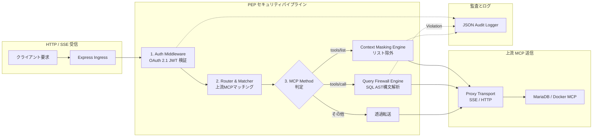

# ZTA MCP Gateway アーキテクチャとデータフロー

本書では、**ZTA MCP Gateway (`zta-mcp-gateway`)** の内部コンポーネント構造、リクエスト/レスポンスのデータフロー、およびコンテナデプロイモデルを解説します。

---

## 1. 内部パイプライン (Internal Pipeline)

ZTA MCP Gateway は、Node.js / Express ベースの軽量プロキシパイプラインとして動作します。



---

## 2. 認可と判定フロー (Decision Flow)

### 2.1 `tools/list` 受信時 (Context Masking)
1. クライアントから `tools/list` が送信される。
2. ゲートウェイは上流MCPサーバーから生のツール定義リストを取得。
3. クライアントのJWTトークン内のロール（`roles: ['analyst']`）を取得。
4. 設定ファイルの `role_mappings.analyst.allowed_tools` と照合。
5. リストに含まれないツール（例: `write_query`, `drop_table`）を配列から完全削除。
6. マスキング済みのツール一覧をクライアントへ返却。

### 2.2 `tools/call` 受信時 (Query Firewall)
1. クライアントから `tools/call` が送信される。
2. 要求されたツール名が、該当ロールで許可されているか検証。許可されていない場合は即座に `403 Forbidden` を返却。
3. `enforce_sql_check: true` が有効な場合、ツール引数の `query`（SQL文字列）を抽出。
4. `node-sql-parser` によりSQLを抽象構文木（AST）に変換。
5. 構文解析によるチェック：
   - 複数のSQL文（セミコロンによる複文）が含まれていないか？
   - ステートメントの種類が `allowed_statements`（例: `SELECT`）以外を含んでいないか？
   - 危険なDDL（`DROP`, `TRUNCATE` 等）が含まれていないか？
6. すべてパスした場合のみ、上流MCPサーバーへ転送。

---

## 3. コンテナデプロイモデル (Deployment Models)

### 3.1 サイドカーモデル (Kubernetes / ECS)
- 同一Podまたは同一タスク内に、上流MCPサーバーコンテナ（例: MariaDB MCP）と ZTA MCP Gateway コンテナを配置。
- 上流MCPサーバーは `localhost` のみでリッスンさせ、外部公開ポートは Gateway のみが公開。

### 3.2 独立集中型ゲートウェイモデル (さくらVPS / オンプレミス / Docker Compose)
- 単一のホスト上に Docker Compose で配置。
- 複数の上流MCPサーバー（MariaDB MCP, Docker Monitor MCP, 社内API MCP）を一括で束ね、パスベースでルーティング（`/mcp/mariadb`, `/mcp/docker`）。

```yaml
# Docker Compose 例
services:
  zta-gateway:
    image: techies-t/zta-mcp-gateway:latest
    ports:
      - "8080:8080"
    volumes:
      - ./config/gateway-config.yaml:/app/config/gateway-config.yaml:ro
      - ./keys:/app/keys:ro
    environment:
      - NODE_ENV=production
      - GATEWAY_JWT_SECRET=super-secret-key-for-local

  mariadb-mcp:
    image: mariadb/mcp-server:latest
    environment:
      - DB_HOST=db.internal
      - DB_PORT=3306
    # 外部にはポートを公開しない (内部ネットワーク経由のみ)
    networks:
      - internal-net
```
