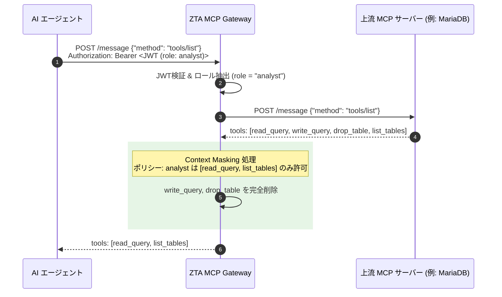

# ZTA MCP Gateway 詳細仕様書 (Technical Specification)

- **文書バージョン**: 1.0.0
- **最終更新日**: 2026年9月6日
- **準拠規格**: 
  - NIST SP 800-207 (Zero Trust Architecture)
  - Model Context Protocol (MCP) Specification (2026-07 Core Stateless Update)
  - OAuth 2.1 (draft-ietf-oauth-v2-1-11)
  - RFC 7519 (JSON Web Token)

---

## 1. はじめに (Introduction)

### 1.1 背景
Model Context Protocol (MCP) は、LLMやAIエージェントが外部ツールやデータベース、APIと対話するための標準プロトコルとして急速に普及しています。しかし、MariaDB公式MCPサーバーをはじめとする既存の多くのMCPサーバーには以下の重大なセキュリティ課題が存在します。

1. **認可モデルの欠如 (No Granular Authorization)**:  
   MCPプロトコル自体は「ツールの定義と呼び出し」を規定するものであり、ユーザーやエージェントのロールに応じた「ツール単位の認可制御（RBAC/ABAC）」をプロトコルレベルで規定していません。結果として、接続したAIエージェントにはすべてのツール（参照・更新・削除）が無条件に提示されます。
2. **Confused Deputy 問題の発生**:  
   一般ユーザーからの依頼を受けたAIエージェントが、自身に付与された広範なMCPツール（例: `write_query`, `drop_table`）を自律的に悪用・誤用してしまうリスクがあります。
3. **ベンダーロックインの懸念**:  
   認証情報やデータベース資格情報の保護において、特定クラウド（AWS等）のKMS/Secrets Managerに密結合すると、オンプレミス、さくらVPS、GCP等の環境で利用できなくなります。

### 1.2 本システムの目的
**ZTA MCP Gateway (`zta-mcp-gateway`)** は、AIエージェントと上流MCPサーバーの間に透過的リバースプロキシとして介在し、以下のコア機能を提供することで上記の課題を抜本的に解決します。

- **Context Masking (AI視界マスキング)**: 接続クライアントのロールに基づき、未認可ツールのメタデータを `tools/list` レスポンスから完全除去。
- **Query Firewall (実行時SQL/引数検証 PEP)**: `tools/call` のペイロードを検査し、SQLパーサーによるAST解析で破壊的クエリや多重クエリを即時遮断。
- **Pluggable Secret Provider (抽象化鍵管理)**: クラウド・オンプレミスを問わず、暗号鍵・資格情報管理プロバイダを容易に交換可能。
- **Headless Architecture (UIレス設計)**: アタックサーフェスを最小化し、設定ファイルまたは外部コントロールプレーン経由で安全に運用。

---

## 2. システムアーキテクチャ (System Architecture)

### 2.1 全体配置図 (Component Overview)

```mermaid
flowchart TB
    subgraph Clients [AI エージェント / クライアント層]
        UI[MacOSUI Web]
        Claude[Claude Desktop]
        Agent[Custom Autonomous Agent]
    end

    subgraph Perimeter [境界制御]
        TLS[TLS 1.3 Termination / Reverse Proxy]
    end

    subgraph Gateway [ZTA MCP Gateway Core (Headless)]
        direction TB
        subgraph Ingress [Ingress & 認証層]
            AuthN[OAuth 2.1 JWT Validator<br/>(RFC 7519 / RS256/ES256)]
            RateLimit[Rate Limiter & Dos Guard]
        end

        subgraph PEP [Policy Enforcement Point]
            ContextMasker[Context Masking Engine<br/>tools/list フィルター]
            QueryFirewall[Query Firewall Engine<br/>tools/call AST 構文解析]
        end

        subgraph Providers [Pluggable Providers]
            SecretProvider[ISecretProvider<br/>Local / GCP / AWS / GitHub / Vault]
        end

        subgraph Observability [可観測性]
            AuditLogger[Structured JSON Audit Logger<br/>SIEM / CloudWatch / Fluentd]
        end
    end

    subgraph UpstreamMCP [上流 MCP サーバー層]
        MariaDB[MariaDB Official MCP<br/>(MySQL/MariaDB DB)]
        DockerMon[Docker Monitor MCP<br/>(Container Monitoring)]
        InternalAPI[社内 Internal MCP<br/>(REST/gRPC Wrapper)]
    end

    Clients -->|HTTPS / SSE<br/>Bearer JWT| TLS
    TLS --> Ingress
    Ingress --> PEP
    PEP <--> SecretProvider
    PEP --> Observability
    PEP -->|Proxy Authorized Requests| UpstreamMCP
```

### 2.2 データプレーン (Data Plane) と コントロールプレーン (Control Plane)
- **データプレーン (Data Plane)**:
  - クライアントからの SSE（`GET /sse`）およびメッセージ送信（`POST /message`）をリアルタイムで中継・検査・マスキングします。
  - メモリフットプリントを抑え、ステートレスに動作します。
- **コントロールプレーン (Control Plane)**:
  - ゲートウェイ自身は管理画面を持たず、起動時に `gateway-config.yaml` を読み込みます。
  - 将来的な動的更新（ホットリロード）は、SIGHUPシグナル、または MacOSUI からの認証済み Management REST API（mTLSまたはAdmin JWT）経由で安全に受け付けます。

---

## 3. ポリシー施行ポイント (PEP) 詳細仕様

ZTA MCP Gateway の中心機能である PEP は、以下の2段階で多層防御（Defense in Depth）を実施します。

### 3.1 Context Masking Engine (`tools/list` フィルタリング)

#### 動作シーケンス


#### 仕様詳細
1. クライアントからの `tools/list` リクエストを受信した際、上流MCPサーバーへ透過中継して全ツール一覧を取得。
2. JWTトークンから抽出したロール（`roles` または `scope`）に基づき、`gateway-config.yaml` に定義された `allowed_tools` ホワイトリストと照合。
3. 許可されていないツールの定義（`name`, `description`, `inputSchema`）を配列から完全に削除。
4. **効果**: AIのコンテキストウィンドウには許可されたツールのみが投入されるため、AIは禁止ツールのパラメータ構造を知ることができず、プロンプトインジェクションによる探索を根本から遮断。

---

### 3.2 Query Firewall Engine (`tools/call` 引数・SQL AST検証)

万が一、クライアントがツールの名前を推測して直接 `tools/call` を送信した場合、あるいは許可された `read_query` ツールに悪意あるSQLが注入された場合に対応します。

#### 動作シーケンス
```mermaid
sequenceDiagram
    autonumber
    participant AI as AI エージェント
    participant GW as ZTA MCP Gateway
    participant Upstream as 上流 MCP サーバー

    AI->>GW: POST /message {"method": "tools/call", "params": {"name": "read_query", "arguments": {"query": "SELECT * FROM users; DROP TABLE logs;"}}}
    GW->>GW: 1. ツール認可判定 (read_query is allowed)
    GW->>GW: 2. Query Firewall (SQL AST 解析)
    
    rect rgb(255, 230, 230)
    Note over GW: 構文解析結果:<br/>- 複文 (Multiple Statements) 検知<br/>- DROP TABLE 文の含有を検知<br/>-> ルール違反 (Violates Read-Only Policy)
    GW->>GW: 監査ログに ALERT 記録
    end

    GW-->>AI: 403 Forbidden / Error: "Execution denied by ZTA Query Firewall: Multi-statements or DDL/DML are prohibited."
    Note over Upstream: 上流サーバーへは一切パケットを送信しない
```

#### SQL AST 解析ルールセット
| 検査項目 | 制限ポリシー | 違反時の処理 |
| :--- | :--- | :--- |
| **単一ステートメント強制** | 1リクエストにつき1つのSQL文のみ許可（`;` による複文実行を禁止） | 403 Forbidden 即時返却 |
| **DML 制限 (SELECT限定)** | `INSERT`, `UPDATE`, `DELETE`, `REPLACE` の検出 | 403 Forbidden 即時返却 |
| **DDL 制限** | `CREATE`, `ALTER`, `DROP`, `TRUNCATE`, `RENAME` の検出 | 403 Forbidden 即時返却 |
| **管理コマンド制限** | `GRANT`, `REVOKE`, `SET`, `FLUSH`, `SHUTDOWN`, `KILL` の検出 | 403 Forbidden 即時返却 |
| **危険な関数制限** | `LOAD_FILE()`, `INTO OUTFILE`, `INTO DUMPFILE`, `SLEEP()`, `BENCHMARK()` の検出 | 403 Forbidden 即時返却 |
| **テーブルホワイトリスト** | 設定ファイルで `allowed_tables` が指定されている場合、AST内のテーブル名がリストに含まれているか検証 | 403 Forbidden 即時返却 |

---

## 4. 認証・認可仕様 (Authentication & Authorization)

### 4.1 OAuth 2.1 M2M トークン検証
- 通信プロトコル: HTTPS / TLS 1.3
- 認証ヘッダー: `Authorization: Bearer <JWT>`
- 検証要件:
  - `iss` (Issuer): 設定ファイルに登録された信頼されたIdP / Auth サーバーと一致すること。
  - `aud` (Audience): `zta-mcp-gateway` または 対象MCPターゲットと一致すること。
  - `exp` (Expiration): 現在時刻より未来であること（リフレッシュトークンによる自動更新をサポート）。
  - 署名アルゴリズム: `RS256` / `ES256`（非対称鍵ペア）を推奨（共有鍵 `HS256` もローカル検証用途として設定可能）。

### 4.2 クレデンシャル・プロキシ（資格情報の代理注入）
上流のサードパーティMCPサーバーが独自の固定APIキーやBasic認証、データベースパスワードを要求する場合、AIクライアントにその資格情報を開示してはなりません。
- ゲートウェイがリバースプロキシとして転送する際、`ISecretProvider` から取得した正式なバックエンド資格情報を `Authorization` ヘッダーや環境変数経由で透過的に注入します。

---

## 5. プラガブル・シークレット・プロバイダ仕様 (`ISecretProvider`)

### 5.1 インターフェース定義 (TypeScript)

```typescript
export interface SecretFetchOptions {
  version?: string;
  cacheTtlMs?: number;
}

export interface ISecretProvider {
  /**
   * プロバイダの初期化（接続テスト、認証）
   */
  initialize(): Promise<void>;

  /**
   * 指定されたキーのシークレット（文字列またはJSON）を取得
   */
  getSecret(key: string, options?: SecretFetchOptions): Promise<string>;

  /**
   * 復号鍵（AESキー等）を取得
   */
  getEncryptionKey(keyId: string): Promise<Buffer>;

  /**
   * プロバイダ名を取得 ('local' | 'gcp' | 'aws' | 'github' | 'vault')
   */
  getProviderName(): string;
}
```

### 5.2 各プロバイダの実装要件

| プロバイダ | 識別子 | 対象ユースケース | 認証・接続方式 |
| :--- | :--- | :--- | :--- |
| **Local** | `local` | さくらVPS、オンプレミス、ローカル開発環境 | 環境変数またはローカルマスターキーファイル (`.key`) による AES-256-GCM 復号 |
| **GCP** | `gcp` | Google Cloud (GKE, Cloud Run, Compute Engine) | Workload Identity / Application Default Credentials (ADC) を用いた Secret Manager & Cloud KMS API |
| **AWS** | `aws` | AWS (EKS, ECS, EC2) | IAM Roles for Service Accounts (IRSA) / インスタンスプロファイルを活用した AWS Secrets Manager & KMS API |
| **GitHub** | `github` | CI/CD パイプライン、GitHub Actions | GitHub REST API (`/repos/{owner}/{repo}/actions/secrets`) + GitHub App / PAT |
| **Vault** | `vault` | 金融機関、大規模エンタープライズ、マルチクラウド | HashiCorp Vault / OpenBao AppRole または Kubernetes サービスアカウント認証 |

---

## 6. 設定ファイルスキーマ仕様 (`gateway-config.yaml`)

```yaml
version: "1.0"

server:
  port: 8080
  host: "0.0.0.0"
  request_timeout_ms: 30000
  cors:
    origin: ["https://app.macosui.local", "https://app.techies.tokyo"]
    credentials: true

# 認証設定
auth:
  issuer: "https://auth.techies.tokyo"
  audience: "zta-mcp-gateway"
  jwks_uri: "https://auth.techies.tokyo/.well-known/jwks.json"
  # ローカル開発用の共有鍵設定 (本番では非対称鍵を使用)
  local_jwt_secret_env: "GATEWAY_JWT_SECRET"

# プラガブル鍵管理
secrets:
  provider: "local" # local | gcp | aws | github | vault
  local:
    master_key_file: "./keys/master.key"
  gcp:
    project_id: "techies-zta"
  aws:
    region: "ap-northeast-1"
  vault:
    endpoint: "https://vault.internal:8200"
    role_id_env: "VAULT_ROLE_ID"
    secret_id_env: "VAULT_SECRET_ID"

# 上流MCPサーバーとルーティング・ポリシー定義
upstreams:
  # 1. MariaDB 公式 MCP サーバー
  - id: "mariadb-upstream"
    path: "/mcp/mariadb"
    target: "http://127.0.0.1:33060/sse"
    description: "Production MariaDB MCP Server with ZTA Protection"
    policies:
      # ロールベースのツールマスキング (Context Masking)
      role_mappings:
        guest:
          allowed_tools: [] # ツール利用不可
        analyst:
          allowed_tools:
            - "read_query"
            - "list_tables"
            - "describe_table"
        operator:
          allowed_tools:
            - "read_query"
            - "write_query"
            - "list_tables"
            - "describe_table"
        admin:
          allowed_tools:
            - "*"
      # 実行時クエリファイアウォール (Query Firewall)
      firewall:
        enforce_sql_check: true
        restricted_roles: ["analyst"]
        allowed_statements: ["SELECT"]
        deny_statements:
          - "INSERT"
          - "UPDATE"
          - "DELETE"
          - "DROP"
          - "ALTER"
          - "TRUNCATE"
          - "GRANT"
          - "REVOKE"
        max_limit: 1000 # SELECTクエリに対する最大取得行数の強制注入 (DoS防止)

  # 2. Docker Monitor MCP サーバー
  - id: "docker-monitor-upstream"
    path: "/mcp/docker"
    target: "http://127.0.0.1:3000/sse"
    description: "Docker Monitor MCP with Container Ops Isolation"
    policies:
      role_mappings:
        viewer:
          allowed_tools:
            - "docker_ps"
        ops:
          allowed_tools:
            - "docker_ps"
            - "docker_logs"
        secadmin:
          allowed_tools:
            - "*"
```

---

## 7. セキュリティ監査ログ仕様 (Audit Logging)

全てのアクセスおよびPEPでの判定結果は、改ざん不能な標準出力（stdout）およびファイルへ、構造化 JSON（JSON Lines）形式で出力されます。

### 7.1 ログスキーマ
| フィールド | 型 | 説明 |
| :--- | :--- | :--- |
| `timestamp` | string (ISO8601) | イベント発生日時 (UTC) |
| `event_id` | string (UUIDv4) | 一意のイベント識別子 |
| `event_type` | string | `ACCESS_ALLOWED`, `ACCESS_BLOCKED`, `FIREWALL_VIOLATION`, `AUTH_FAILED` |
| `client_id` | string | JWTの `sub` または `client_id` |
| `roles` | array of string | 判定に使用されたロール一覧 |
| `upstream_id` | string | 対象の上流MCPサーバーID |
| `method` | string | MCPメソッド (`tools/list`, `tools/call`, `prompts/get` 等) |
| `tool_name` | string (optional) | `tools/call` 時に要求されたツール名 |
| `decision` | string | `ALLOW` または `DENY` |
| `reason` | string (optional) | 遮断理由（例: `DISALLOWED_TOOL`, `SQL_FIREWALL_DDL_DETECTED`） |
| `details` | object | 違反クエリのスニペットやASTパース詳細情報 |

### 7.2 遮断ログの出力例 (JSON Lines)
```json
{
  "timestamp": "2026-09-06T01:45:12.345Z",
  "event_id": "8b9a1c2d-3e4f-5a6b-7c8d-9e0f1a2b3c4d",
  "event_type": "FIREWALL_VIOLATION",
  "client_id": "agent-sales-reporting",
  "roles": ["analyst"],
  "upstream_id": "mariadb-upstream",
  "method": "tools/call",
  "tool_name": "read_query",
  "decision": "DENY",
  "reason": "SQL_FIREWALL_STATEMENT_DENIED",
  "details": {
    "detected_statement": "DROP TABLE",
    "raw_query_truncated": "SELECT * FROM sales; DROP TABLE sales_logs; --",
    "remote_ip": "10.0.1.45"
  }
}
```

---

## 8. パフォーマンス & 高可用性 (Performance & HA)

1. **ゼロステート・スケーラビリティ**:
   - ゲートウェイは自身でセッションキャッシュを抱えず、ステートレスに動作するため、KubernetesやECS、ロードバランサー配下で自由に水平スケーリング（Pod / コンテナ追加）可能。
2. **低レイテンシ・オーバーヘッド**:
   - リバースプロキシおよびSQL ASTパースによる遅延を **5ミリ秒以内** に抑える軽量なJavaScriptパーサーエンジンを採用。
3. **ヘルスチェック**:
   - `GET /healthz`: ゲートウェイ自体の稼働状態
   - `GET /readyz`: 各上流MCPサーバーへのヘルスチェック中継結果
